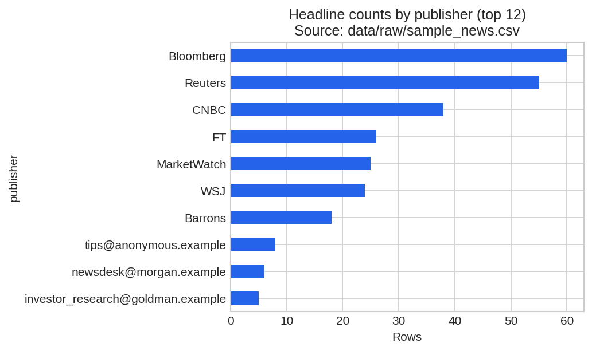
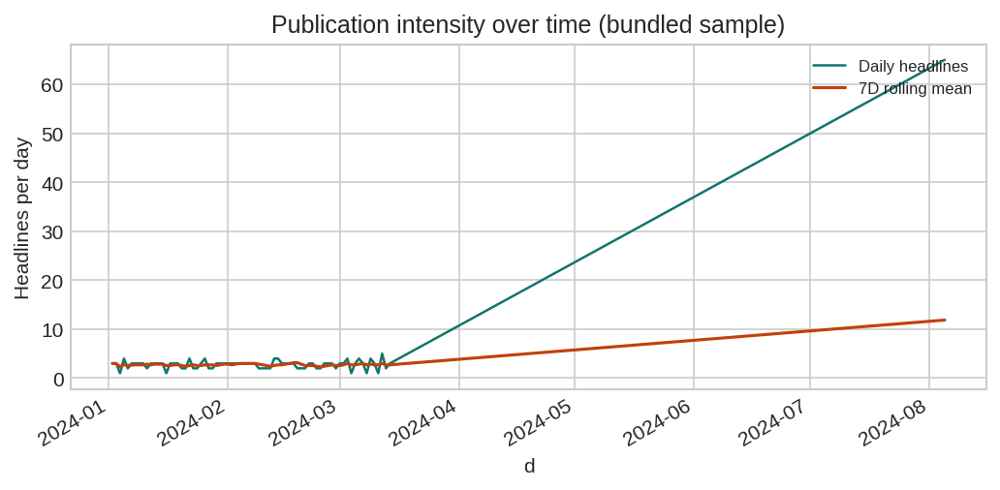
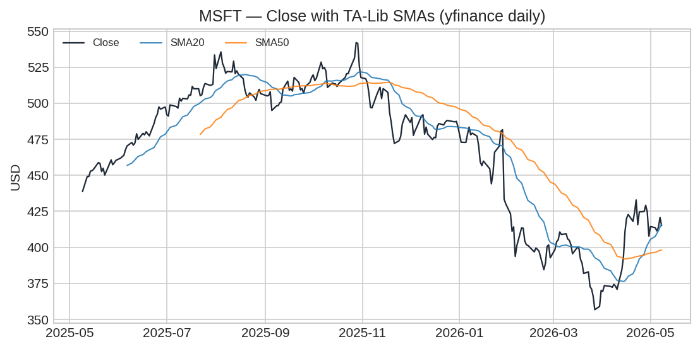
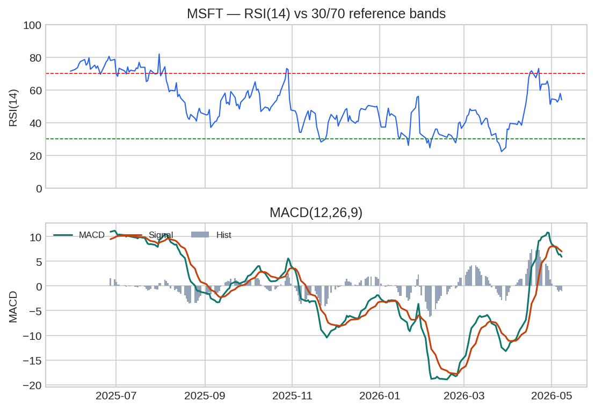

# Interim Report — Week 1  
**Course:** 10 Academy · Artificial Intelligence Mastery  
**Project:** Financial news & equity integration (Nova Financial Solutions / FNSPID-style)  
**Format note (Microsoft Word):** Copy sections into a `.docx` file. For each **Figure A–D**, use **Insert → Pictures** and choose the matching file in `reports/figures/` (PNG). After pasting text from this file, **right‑click picture → Insert Caption** as “Figure A”, etc., so the rubric reviewers see clear **in-document** evidence.

---

## 1. Understanding and defining the business objective

**Problem.** Investment and research teams need to know whether **financial news flow** (volume, source mix, and eventually tone) helps explain **price trends, momentum, and volatility** for the equities that appear in the feed. Raw headlines and raw prices are not enough: we need a **repeatable pipeline**, **quality-controlled inputs**, and **visual and numeric evidence** before any modeling claims.

**Objective (interim scope).** Demonstrate that we can:

1. **Load and clean** FNSPID-style headlines and daily OHLCV for the same tickers.  
2. **Profile the news** (who publishes, when intensity spikes) and **profile the market** (trend and classic indicators).  
3. **Document findings in the report itself** using **embedded figures and tables**, not only notebooks.

**Success criteria for this phase (met here).** Reproducible cleaning rules; **publisher and time patterns** visible in charts; **TA-Lib + PyNance** metrics computed for a headline-weighted ticker **MSFT** (49 rows in current `sample_news.csv`); evidence suitable for paste into **Word**.

**Out of scope for this interim.** Full sentiment model, live trading rules, and causal event-study inference—these require a **merged news–price timeline** (planned as the top next step).

---

## 2. Discussion of completed work and initial analysis

### 2.1 Data loading and quality controls

**News** (`data/raw/sample_news.csv`; notebook `notebooks/01_eda_financial_news.ipynb`). Required fields: `headline`, `url`, `publisher`, `date`, `stock`. Leading `Unnamed:*` columns removed. Dates parsed to **UTC-aware** timestamps; bad dates counted and excluded from time-series plots. Analysis frame keeps `headline`, `publisher`, `date`, `stock` plus `headline_len` and `word_count`. **`url` is required in the file but not carried into the modeling frame.**

**Prices** (notebook `notebooks/02_technical_analysis_talib_pynance.ipynb`). Daily bars from **yfinance** for tickers implied by the news sample plus **SPY** benchmark (or offline CSV via env `YFINANCE_OFFLINE_CSV`). OHLC/Adj Close stored as `float64`; volume as nullable `Int64`. **QC:** drop bars with non-positive prices or `High < Low`; forward-fill small OHLC gaps; drop rows without a valid `Close`.

**Figure regeneration (optional):**  
`python scripts/export_interim_report_figures.py` → writes PNGs to `reports/figures/`.

---

### 2.2 Initial analysis — news (Task 1)

**Publisher concentration (sampling risk).** A few desks account for most rows. In the bundled sample, counts include **Bloomberg 60**, **Reuters 55**, **CNBC 38** (others in **Figure A**). *Implication:* downstream language models or sentiment scores may be **outlet-skewed**; stratify or control for publisher family.

**Publication intensity over time.** Daily headline counts fluctuate; the **7-day rolling mean** (**Figure B**) highlights sustained vs one-off busy periods—useful for later checks against volatility clusters.

**Figure A.** Top publishers — long tail and concentration.

**Figure B.** Daily counts and 7-day rolling average.

---

### 2.3 Initial analysis — prices & indicators (Task 2)

**Focus ticker for exported charts:** **MSFT** (most headlines in current sample).

**methods (summary).** **TA-Lib** on **`Close`:** SMA(20), SMA(50), RSI(14), MACD(12,26,9). **PyNance** (in notebook): simple returns / log growth on **Adj Close**; **20-day annualized volatility** (√252 scaling on daily log returns) to relate news bursts to **realized risk** once timelines are merged.

**Quantitative snapshot (approx. 1-year yfinance window; re-run export script before final submit if needed):**

| Indicator | MSFT |
|-----------|------|
| Observations | 251 trading days |
| Latest close | 415.12 USD |
| RSI(14), latest | 53.89 (neutral vs 30/70 bands) |

**Chart-based reading.** **Figure C:** price vs SMAs describes **slow vs faster trend**. **Figure D:** RSI placement and MACD histogram/signal dynamics describe **short-horizon momentum**—read together with Figure B (news flow), not as stand-alone triggers.

**Figure C.** MSFT daily close with TA-Lib SMA(20) and SMA(50).

**Figure D.** RSI(14) with reference bands and MACD(12,26,9).

---

## 3. Next steps and key areas of focus

| Priority | Focus area | Planned deliverable |
|----------|------------|---------------------|
| **1** | **News–price alignment** | Merge on `(stock, trading date)` with event windows **`[t−1, t, t+1]`** sessions relative to headline timestamp (timezone rules documented). |
| **2** | **Sentiment & features** | Dictionary or transformer-based polarity + topic tags; relate to abnormal returns/vol spikes on aligned dates. |
| **3** | **Evidence in the Word report** | Additional exports: headline length ECDFs, ticker co-mentions, SPY-relative returns—each with **captions interpreting direction of effect**. |
| **4** | **Inference** | At least one **hypothesis test or regression table** printed in the final document (not notebook-only). |
| **5** | **Governance** | Pin dependency versions; keep `pytest` smoke checks passing; finalize PR merge hygiene (`task-1`→`main`, then integrated `task-2`). |

---

## 4. Report structure, clarity, and conciseness

**Structure.** This report follows the required narrative arc: **(1)** what we are trying to accomplish for the business, **(2)** what was built and what the data showed (with **Figures A–D** and one **metrics table**), **(3)** what we will tackle next **in priority order**.

**Clarity.** Figure captions tie each chart to a **single takeaway** (concentration, timing, trend, momentum). Technical stack names (**TA-Lib**, **PyNance**, **yfinance**) are explicit so reviewers can map text to notebooks.

**Conciseness.** Body text stays short; proof is delegated to **visuals + one summary table**. For **≤3 pages in Word**, use **single spacing**, **narrow margins**, and shrink figure height slightly if captions push you over one page—the rubric favors **density with evidence**, not repetition.
