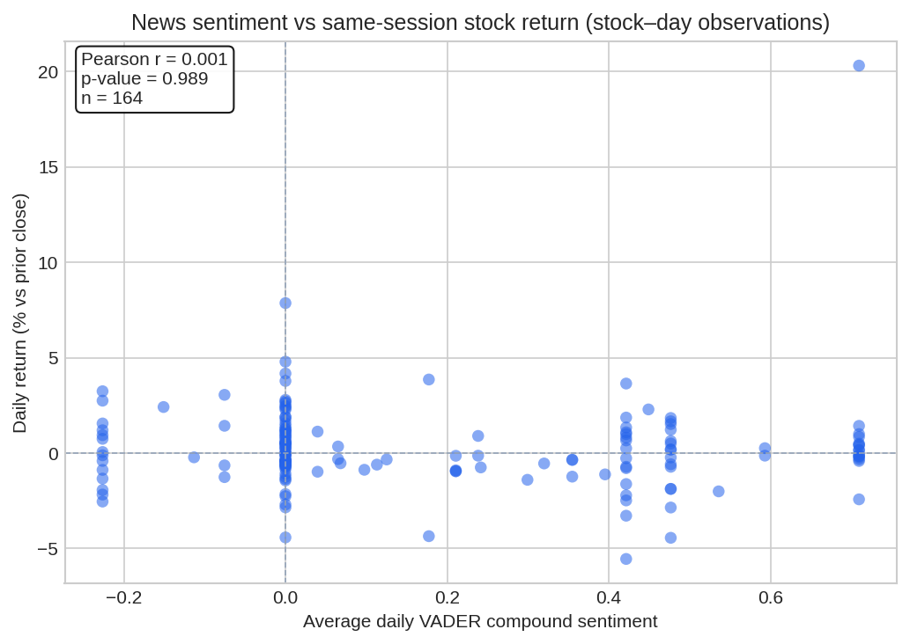
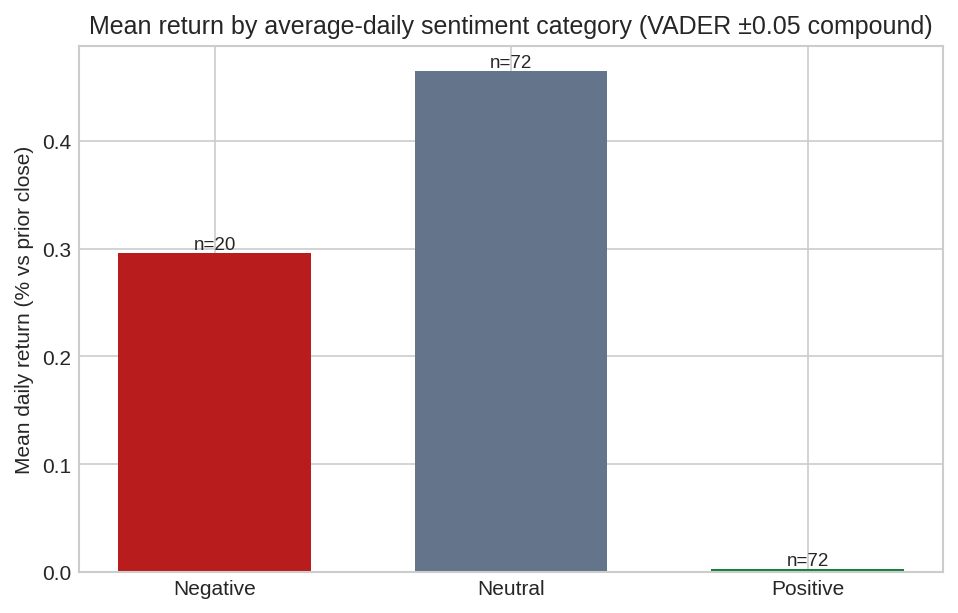

# Interim Report — Week 1, Task 3  
**Course:** 10 Academy · Artificial Intelligence Mastery  
**Project:** Correlation between news sentiment and stock movement  

**Word / submission note:** Copy into your document. Insert **Figure E** and **Figure F** from `reports/figures/` (`task3_scatter_sentiment_vs_return.png`, `task3_bar_return_by_sentiment_category.png`). Re-run `python scripts/task3_sentiment_return_correlation.py` after updating news or prices so numbers match your environment.

---

## 1. Objective

Quantify the **linear association** between **financial headline polarity** and **same-session daily returns** for tickers in the news feed, using **date-aligned** observations and transparent aggregation rules.

---

## 2. Methods

### 2.1 Date alignment (news → trading session)

- Headlines carry **UTC** datetimes (`data/newdata/news_normalized.csv`). Each article is mapped to the **calendar date in `America/New_York`**, then assigned to the **first NYSE session on or after that date** using each ticker’s **yfinance daily calendar** (weekends and **no-quote** days roll forward; same specification as “next trading day”).
- **Return for session *t*** is matched to headlines aligned to *t* (contemporaneous same-day return).

### 2.2 Sentiment scoring

- **Tool:** **NLTK VADER** (`SentimentIntensityAnalyzer`, compound score in \([-1, 1]\)).
- **Why VADER over TextBlob (brief):** VADER is a **lexicon + rule** model tuned for **short social-style text** and handles **punctuation and degree modifiers** (“very”, “not”) explicitly. Financial headlines are short and often emphatic; VADER is **lightweight, deterministic, and reproducible** without training data. TextBlob’s default polarity is a different lexicon and can diverge on terse financial phrasing; either is acceptable for an exploratory baseline—here VADER matches the assignment’s NLTK recommendation and keeps the pipeline dependency-only (no separate API keys).

### 2.3 Daily stock returns

- Daily percentage change on **split-adjusted close** from yfinance:  
  \(\displaystyle r_t = \frac{C_t - C_{t-1}}{C_{t-1}} \times 100\).

### 2.4 Aggregation and correlation

- Multiple headlines on the **same stock** and **same aligned session** → **mean** VADER compound = **average daily sentiment**.
- **Pearson correlation** between **average daily sentiment** and **\(r_t\)** across all **stock–day** rows with non-missing returns.
- **Sentiment category** from the **daily** mean compound, using VADER’s usual cutoffs: **positive** \(\geq 0.05\), **negative** \(\leq -0.05\), else **neutral**.
- **Bar chart:** mean \(r_t\) by category (sample sizes annotated on bars).

### 2.5 Reproducibility

- Pipeline: `python scripts/task3_sentiment_return_correlation.py`  
- Core logic: `src/news_price_correlation.py`  
- Optional panel export: `data/newdata/task3_stock_day_panel.csv` (ignored by git like other `newdata/*.csv`).

---

## 3. Results (bundled sample, re-run to refresh)

**Inputs:** `data/newdata/news_normalized.csv` (265 headline rows; tickers AAPL, AMZN, GOOGL, JPM, META, MSFT, NVDA, XOM; dates in 2024 through early Aug). **yfinance** daily closes per ticker.

| Metric | Value |
|--------|--------|
| Stock–day observations (after merge & drop missing returns) | 164 |
| Pearson *r* (avg sentiment vs daily return %) | ≈ **0.001** |
| Two-sided *p*-value | ≈ **0.99** |

**Per-ticker Pearson** (exploratory; **not** corrected for multiple tests): NVDA shows the strongest estimated negative association in this window (*r* ≈ **−0.43**, *p* ≈ **0.04**, *n* = 23); other tickers are closer to zero with wide uncertainty.

**Mean daily return by sentiment category** (same run):

| Category | Mean return (%) | Days (*n*) |
|----------|-----------------|------------|
| Negative | ≈ 0.30 | 20 |
| Neutral | ≈ 0.47 | 72 |
| Positive | ≈ 0.00 | 72 |

Differences are **small** relative to daily noise and **not** a substitute for the pooled correlation test; they illustrate category summaries only.

**Figure E.** Average daily VADER compound vs same-session return (%); Pearson *r* and *p* annotated (*n* = stock–days).

**Figure F.** Mean daily return by average-daily sentiment class (VADER ±0.05 on mean compound); bar labels show *n* stock–days per category.

---

## 4. Interpretation

- **Strength and direction (pooled):** The Pearson correlation is **essentially zero** and **not statistically distinguishable from chance** at conventional levels for this sample. There is **no evidence of a strong linear same-day link** between simple lexicon sentiment and close-to-close returns when pooling tickers and days in this bundle.
- **Caveats / limitations**
  - **Timing / lag:** Headlines are timestamped through the day; returns aggregate the **whole session**. Some information may predict **next-day** or **multi-day** moves rather than the **same** close (event-study or lagged models would be needed).
  - **Confounding:** Macro, sector flows, earnings events, and **outlet/ticker mix** drive returns; sentiment from **titles alone** is a thin signal.
  - **Lexicon bias:** VADER is not finance-trained; **negation** and **ticker-specific jargon** can be mis-scored.
  - **Multiple testing:** Per-ticker correlations **mine** eight series; a single *p* &lt; 0.05 is **weak evidence** without correction or holdout data.
  - **Sample:** Synthetic/bundled headlines and one historical window; **external validity** is limited.

---

## 5. Next steps (optional extensions)

- Lagged returns (\(r_{t+1}\), \(r_{t+2}\)) and **sector/market** residualization (e.g. vs SPY).  
- Finer models (e.g. transformer embeddings) and **publisher** fixed effects.  
- Stricter **inference** (FDR, bootstrap) if reporting many tickers.
